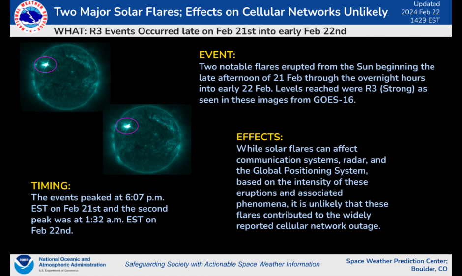
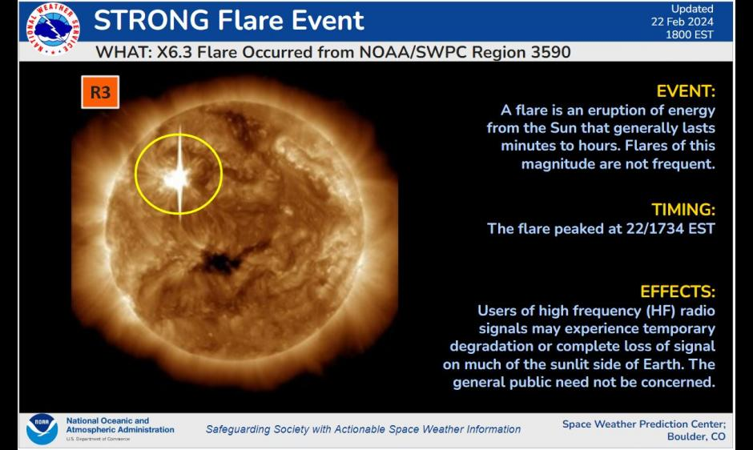

# Solar Flare Prediction

Intent for this repo is to configure and demonstrate a cloud-native environment purpose built for data scientists to tackle the Machine Learning Development Lifecycle (MLDMC) simulating detection and prediction of solar flares.

## Recent Events

Why solar flares?

On February 22, 2024, three top-tier X-class solar flares launched off the sun between Wednesday and Thursday.

The first two occurred seven hours apart (02-21-24 18:07 EST and 02-22-24 01:32 EST), coming in at X1.9 and X1.6 magnitude respectively.

The third, the most powerful of the current 11-year “solar cycle,” ranked an impressive X6.3 (02-23-24 1734 EST). [source](https://www.washingtonpost.com/weather/2024/02/22/solar-flares-cycle-xclass-radio-att/), [source](https://www.esa.int/Space_Safety/Space_weather/Sun_fires_off_largest_flare_of_current_solar_cycle), [source](https://www.swpc.noaa.gov/news/two-major-solar-flares-effects-cellular-networks-unlikely) and [source](https://www.swpc.noaa.gov/news/strongest-flare-current-solar-cycle).

All three of the X-class solar flares disrupted shortwave radio communications on Earth.

The third solar flare, which ranked an X6.37 in magnitude. Notice the fuzzy appearance on the sensor. It was being bombarded by photons and high-energy electrons associated with the flare. This results in a “wide area blackout of [high frequency] radio communication, [and] loss of radio contact for about an hour on sunlit side of Earth.” [source](https://www.washingtonpost.com/weather/2024/02/22/solar-flares-cycle-xclass-radio-att/)

[source](https://www.washingtonpost.com/weather/2024/02/22/solar-flares-cycle-xclass-radio-att/)

