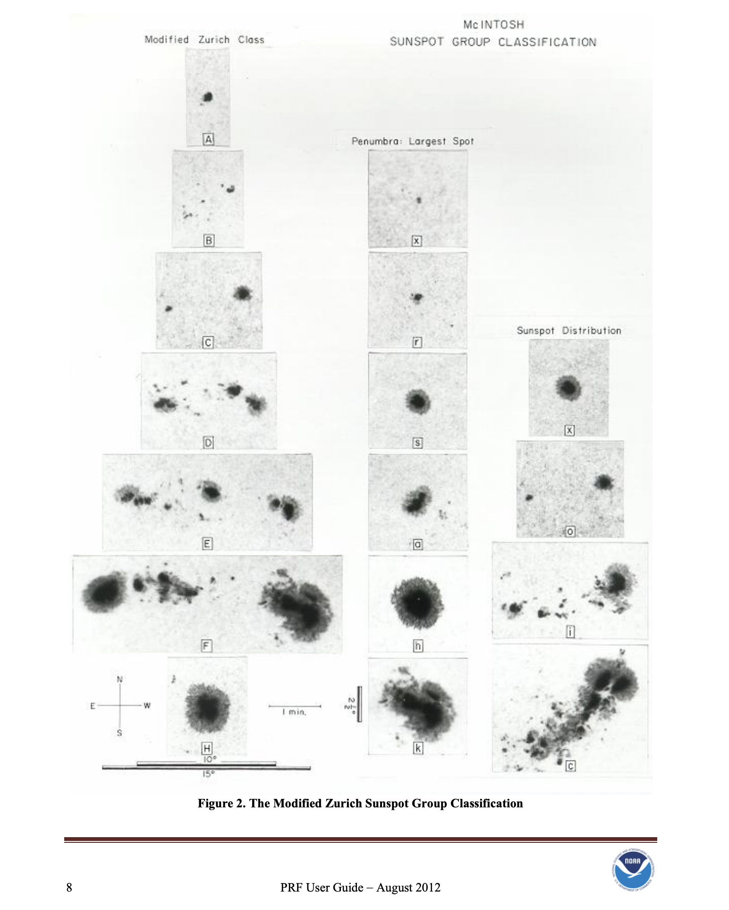

# Solar Flare Prediction

Intent for this repo is to configure the Red Hat OpenShift environment and ML tools needed for data scientists to prepare data and code ML system to predict solar flares.

## Recent Events


On Feburary 22, 2024, three top-tier X-class solar flares launched off the sun between Wednesday and Thursday. 


The first two occurred seven hours apart (02-21-24 18:07 EST and 02-22-24 01:32 EST), coming in at X1.9 and X1.6 magnitude respectively. 


The third, the most powerful of the current 11-year “solar cycle,” ranked an impressive X6.3 (02-23-24 1734 EST). [source](https://www.washingtonpost.com/weather/2024/02/22/solar-flares-cycle-xclass-radio-att/), [source](https://www.esa.int/Space_Safety/Space_weather/Sun_fires_off_largest_flare_of_current_solar_cycle), [source](https://www.swpc.noaa.gov/news/two-major-solar-flares-effects-cellular-networks-unlikely) and [source](https://www.swpc.noaa.gov/news/strongest-flare-current-solar-cycle).

All three of the X-class solar flares disrupted shortwave radio communications on Earth.

The third solar flare, which ranked an X6.37 in magnitude. Notice the fuzzy appearance on the sensor. It was being bombarded by photons and high-energy electrons associated with the flare. This results in a “wide area blackout of [high frequency] radio communication, [and] loss of radio contact for about an hour on sunlit side of Earth.” [source](https://www.washingtonpost.com/weather/2024/02/22/solar-flares-cycle-xclass-radio-att/)

[source](https://www.washingtonpost.com/weather/2024/02/22/solar-flares-cycle-xclass-radio-att/)


## Background



Solar flares, or bursts of radiation, are ranked on a scale that goes from A, B and C to M and X, in increasing order of intensity. They usually originate from sunspots, or bruiselike discolorations on the surface of the sun. The more sunspots, the more opportunities for solar flares.

Solar flares and accompanying coronal mass ejections, or CMEs, can influence “space weather” across the solar system, and even here on Earth. 

CMEs are slower shock waves of magnetic energy from the sun. Flares can reach Earth in minutes, but CMEs usually take at least a day.

## Look ahead

“The level of activity here is the biggest it’s been since about 20 years, since about 2003,” said Mark Miesch, a member of the solar modeling team at NOAA’s Space Weather Prediction Center.

The Halloween Storms of 2003 brought dazzling green, red and purple aurora all the way to California, Texas, Florida and even Australia. They also disrupted more than half of all spacecraft orbiting Earth, damaged a satellite beyond repair and created communication issues for airlines and research groups in Antarctica.

The sun is currently in its 25th solar cycle since observations in the 1700s.

Almost halfway through its current solar cycle, the sun is expected to reach its peak activity between January and October 2024, but activity will probably still be high into 2025 or maybe 2026, according to Space Weather Prediction Center models. [source](https://www.washingtonpost.com/climate-environment/2024/01/14/solar-max-sun-activity-storms-aurora/)

Goal: Demonstrate platform resources applied to GONG data fetch and ETL, ML experimentation and distributed training, and ML deployment on OpenShift. 

# Data
source: National Solar Observatory Global Oscillation Network Group
requested: https://gong2.nso.edu/archive/patch.pl?menutype=s
specific range: https://nispdata.nso.edu/ftp/oQR/zqa/202402/

| Location | Relevant Sensor Data | Product* | Date Range | Data Link | Image Count |
|---|---|---|---|
| Learmonth, Australia | [x] | [x] | 2024-02-01:2024-02-29 | | 1325 |
| Udaipur, India | [x] | [x] | 2024-02-01:2024-02-29 | [data](https://nispdata.nso.edu/ftp/oQR/zqa/202402/) | 938 |
| El Teide, Spain | [x] | [x] | 2024-02-01:2024-02-29 | [data] | 1336 |
| Cerro Tololo, Chile | | |
| Big Bear, California | | |
| Mauna Loa, Hawaii | | |
| TE Engineering site, Boulder, Colorado | | |
| TC Engineering site, Boulder, Colorado | | |

*Product == Average Magnetogram (Zero Point Corrected)

## Observations
- EST (Eastern Standard Time). UTC (Universal Time). UTC is 4 hours ahead of EST. So, when it is  11:00 am EST it will be 3:00 pm UTC.
- Learmonth, Australia Avg. Magnetogram skips from 06:54 UT to 23:04 UT on 2024-02-22

# Ideas 

Automate data engineering with s2i build process with custom runtime script:
1. (simulate) apache web server off cluster hosting a zip file of gong dataset with s2i and Containerfile
1. (extract) fetch the compressed data from simulated gong2.nso.edu with a cronjob
1. (transform) decompress the data with untar and gzip -d  with the same cronjob
1. (load) write the data to blob/object storage  with the same cronjob
1. (load) write the data to an apache container with the same
1. connect to the data with IDE tools jupyter with Dev Spaces or RHOAI

# Experimentation
Distributed training:
1. train/tune with codeflare on OCP

# Deployment
1. ML serving 
1. model Containerfile via s2i

# Setup 

assumptions:
1. you are logged into the OpenShift cluster with cluster-admin

## Cluster Configuration

Install the Web Terminal Operator via the OperatorHub - (linked here)[https://github.com/redhat-na-ssa/demo-ai-gitops-catalog/tree/main?tab=readme-ov-file#bootstrapping-a-cluster]

```
# bootstrap the cluster from the Web Terminal copying, pasting and running the following script
YOLO_URL=https://raw.githubusercontent.com/codekow/demo-ai-gitops-catalog/main/scripts/library/term.sh
. <(curl -s "${YOLO_URL}")
term_init

# make custom web terminal persistent
apply_firmly bootstrap/web-terminal

# basic cluster config

# load functions
. scripts/functions.sh

# setup an enhanced web terminal on a default cluster
# alt cmd: until oc apply -k bootstrap/web-terminal; do : ; done
apply_firmly bootstrap/web-terminal

# setup a default cluster w/o argocd managing it
apply_firmly clusters/default

# setup a dev spaces demo /w gpu
apply_firmly demos/devspaces-nvidia-gpu-autoscale

# setup a rhods demo /w gpu
apply_firmly demos/rhods-nvidia-gpu-autoscale
```

## Label Studio

- Text (txt)
- Audio (wav, mp3, flac, m4a, ogg)
- Video (mpeg4/H.264 webp, webm*)
- Images (jpg, jpeg, png, gif, bmp, svg, webp)
- HTML (html, htm, xml)
- Time Series (csv, tsv)
C- ommon Formats (csv, tsv, txt, json)

```
oc apply -k components/configs/kustomized/label-studio/overlays/default/
```

## Minio Object Storage

MinIO is a high performance, distributed object storage system. It is software-defined, runs on industry standard hardware and is 100% open source with the dominant license being GNU AGPL v3. (source)[https://min.io/product/overview]

From the Web Terminal

```
# deploy minio object storage in a namespace from the web terminal
oc apply -k components/configs/kustomized/minio/overlays/with-namespace-known-password

# manually create a bucket

# manually create an access key
```

## Create a devfile.yaml for DevSpaces

Devfiles are yaml text files used for development environment customization. Use them to configure a devfile to suit your specific needs and share the customized devfile across multiple workspaces to ensure identical user experience and build, run, and deploy behaviours across your team.

- Reduce the gap between development and deployment
- Find available devfile stacks or samples in a devfile registry
- Produce consistent build and run behaviors

see (source)[https://devfile.io/docs/2.1.0/benefits-of-devfile] and (Red Hat Dev Spaces)[https://access.redhat.com/documentation/en-us/red_hat_openshift_dev_spaces/3.12/html/user_guide/devfile-introduction].

```
schemaVersion: 2.2.0
metadata:
  name: devspaces-gpu
attributes:
#   controller.devfile.io/scc: container-build
  controller.devfile.io/storage-type: ephemeral
projects:
  - name: solar-flare-prediction
    git:
      remotes:
        origin: "https://github.com/dmarcus-wire/solar-flare-prediction.git"
      checkoutFrom:
        revision: main
components:
  - attributes:
      container-overrides:
        resources:
          limits:
            nvidia.com/gpu: '1'
      controller.devfile.io/merge-contribution: true
    container:
      # image: ghcr.io/redhat-na-ssa/udi-cuda:11.8.0-cudnn8-devel-ubi8
      image: ghcr.io/redhat-na-ssa/udi-cuda:latest
      memoryLimit: 2G
      cpuLimit: 1000m
      mountSources: true
      sourceMapping: /projects
    name: python
```

## Create job for ETL

A job automates the completion of a task only once, in contrast to a replication controller, runs a pod with any number of replicas to completion. A job tracks the overall progress of a task and updates its status with information about active, succeeded, and failed pods. (source)[https://docs.openshift.com/container-platform/3.11/dev_guide/jobs.html#dev-guide-jobs]

*A replication controller ensures that a specified number of replicas of a pod are running at all times. If pods exit or are deleted, the replication controller acts to instantiate more up to the defined number.*

A job configuration consists of the following key parts:
1. A pod template, which describes the application the pod will create.
1. An optional parallelism parameter, which specifies how many pod replicas running in parallel should execute a job. If not specified, this defaults to the value in the completions parameter.
1. An optional completions parameter, specifying how many concurrently running pods should execute a job. If not specified, this value defaults to one.

```
apiVersion: batch/v1
kind: Job
metadata:
  name: gong-data-etl
spec:
  parallelism: 1    
  completions: 1    
  template:         
    metadata:
      name: pi
    spec:
      containers:
      - name: pi
        image: perl
        command: ["perl",  "-Mbignum=bpi", "-wle", "print bpi(2000)"]
      restartPolicy: OnFailure    
```

parallelism: Optional value for how many pod replicas a job should run in parallel; defaults to completions
completions: Optional value for how many successful pod completions are needed to mark a job completed; defaults to one.
template: Template for the pod the controller creates.
restartPolicy: The restart policy of the pod. This does not apply to the job controller. 

### Job usage

You can create the job in a namespace

```
oc create -f jobs.yaml -n <Project/Namespace>
```

You can also create and launch a job from a single command using oc run. The following command creates and launches the same job as specified in the previous example:

```
$ oc run pi --image=perl --replicas=1  --restart=OnFailure \
    --command -- perl -Mbignum=bpi -wle 'print bpi(2000)'
```

A job can be scaled up or down by using the oc scale command with the --replicas option, which, in the case of jobs, modifies the spec.parallelism parameter.

A job can be defined by maximum duration by setting the activeDeadlineSeconds field. It is specified in seconds and is not set by default. When not set, there is no maximum duration enforced.


## Create Cronjob for ETL

A cron job builds on a regular job by allowing you to specifically schedule how the job should be run.


## Copying local files to the Container

Support for copying local files to or from a container is built into the `oc` CLI. You MUST install `rysnc` on the client. (source)[https://docs.openshift.com/container-platform/4.14/nodes/containers/nodes-containers-copying-files.html]

```
# To copy a local directory to a pod directory
# oc rsync <local-dir> <pod-name>:/<remote-dir> -c <container-name>
oc rsync ~/Downloads/ redis:/data

# connect to the pod container
# oc rsh --container CONTAINERNAME POD
oc rsh --container redis redis
cd data

# untar the files
for f in *.tar; do
  tar xf "$f" &
done
wait

# gunzip the files
for f in *.gz; do
  gzip -d "$f" &
done
wait

# check files (1138 count)
ls -l . | wc -l

# manual upload files to minio storage bucket
```

## Configure conda for project

Script to configure conda. 

In this script, the conda shell.bash hook command sets up shell functions for Conda. The eval command then evaluates the output of this command. Finally, conda activate myenv activates the Conda environment named myenv. (source)[https://saturncloud.io/blog/activating-conda-environments-from-scripts-a-guide-for-data-scientists/#activating-a-conda-environment-from-a-script]

### Setup script
```
#!/bin/bash

# USAGE '$ source ./setup.sh'
# UPDATE YOUR ENV NAME AND VERSION
ENV=solar-flare
VERS=3.12

# install miniconda
mkdir -p ~/miniconda3
wget https://repo.anaconda.com/miniconda/Miniconda3-latest-Linux-x86_64.sh -O ~/miniconda3/miniconda.sh
bash ~/miniconda3/miniconda.sh -b -u -p ~/miniconda3
rm -rf ~/miniconda3/miniconda.sh

# initialize newly-installed Miniconda
$PWD/miniconda3/bin/conda init bash
$PWD/miniconda3/bin/conda init zsh

echo "update conda"
conda update -n base -c defaults conda -y

echo "check if conda $ENV exists"
if conda env list | grep -q "\b$ENV/b";then
    echo "conda environment $ENV already exists"
else
    "create the conda environment $ENV"
    conda create -n $ENV python=$VERS -y
fi

echo "activate the virtual env"
eval "$(conda shell.bash hook)"
conda activate $ENV

echo "install packages from conda-forge"
conda install -c conda-forge jupyterlab matplotlib opencv boto3 -y

echo "match the python version"
python -m ipykernel install --user --name=$ENV

echo "default conda env"
conda info | egrep "conda version|active environment"
```

### Cleanup script

```
#!/bin/bash

# UPDATE YOUR ENV NAME
ENV=solar-flare

eval "$(conda shell.bash hook)"

echo "init the conda env"
conda init bash

echo "deactive conda env"
conda deactivate

# wait for 5 seconds
sleep 5

echo "delete conda env"
conda env remove --name=$ENV -y
```

## Launch Dev Space based on github devfile.yaml

